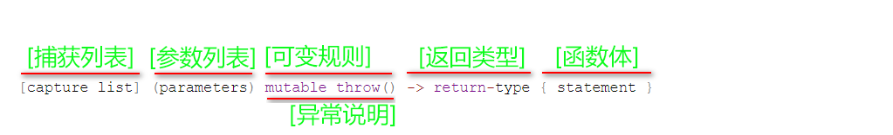

# Lambda表达式

Lambda表达式就是匿名函数。

Lambda表达式可以像对象一样使用，比如可以将它们赋给变量和作为参数传递，还可以像函数一样对其求值。

## Lambda表达式形式

```
[capture](parameters)->return-type{body}
```

* [capture]捕捉列表，总是在lambda表达式开始处，事实上[]是lambda表达式引出符。
* (parameters)参数列表，如果不需要参数传递，可以直接省略括号()。
* ->return-type返回类型，在返回类型明确的情况下，也可以省略这个。
* {body}函数体，必备



如：

```c++
[](int x, int y){return x < y;}
[](int x, int y)->int {int z = x + y; return z + x;}//指定返回类型
```

```c++
[]		//没有定义任何变量，使用未定义变量会引发错误
[x,&y]	//x以传值的方式传入(默认)，y以引用的方式传入
[&]		//任何被使用到的外部变量都隐式地以引用方式加以引用
[=]		//任何被使用到的外部变量都隐式地以传值方式加以引用。
[&,x]	//x显式地传值方式加以引用，其它变量以引用方式
[=,&z]	//z显示地引用方式，其余以传值方式引用
[this] 	//值传递方式是捕获当前this指针
```

另外有一点需要注意，对于`[=]`或`[&]`的形式，lambda可以直接使用this指针，但对于[]形式，使用this指针必须显式传入：

```c++
[this](){this->someFunc();}();
```

* lambda的父作用域，就是包含Lambda函数的语句块，就是{}作用域中。

* 作用域以及Lambda详解：

  [C++：lambda表达式_c++ lambda 表达式参数列表 引用_algsup的博客-CSDN博客](https://blog.csdn.net/qq_43152052/article/details/122366178)

## 示例

```c++
std::sort(x,x+n,[](float a, float b){ return a < b;});
//相当于
bool cmp(float a, float b) { return a < b;}
```

也就是说，Lambda表达式的参数列表，

