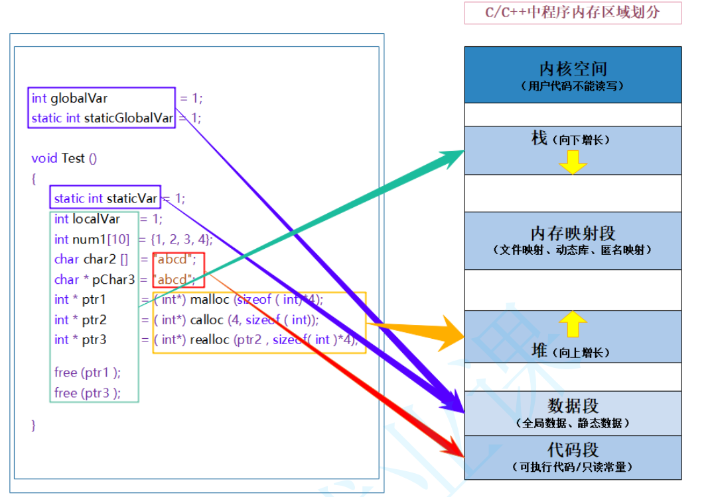

# C++ 内存管理



## 动态内存管理

注意：new与delete要配合使用，并注意将delete释放后的指针指向nullptr，避免野指针。

注意，delete不要释放同一个内存两次，会导致不可预测后果。

因此不要创建两个指向同一个内存块的指针，避免删除同一块内存两次。

* new[]与delete[]用来管理几个连续的空间块，比如数组。

```c++
int* ptr1 = new int(10);
char* ptr2 = new char[5];	//可以直接初始化new char[4]{1,2,3,4}
delete ptr1;
delete[] ptr2;		//告诉程序应当释放整个数组而不是一个指针
```

* malloc和free是函数，而new与delete是操作符
* malloc申请空间失败时，返回是NULL，因此必须判空，而new不需要判空，只是需要捕获异常。
* new与delete在执行自定义类型对象时，new自动调用构造函数，delete自动调用析构函数。
* new[]本质上是执行了N个对象空间的申请，执行了N次构造函数；delete[]类似。

## 智能指针

实际上就是一些模板类，负责自动管理一个指针的内存，避免了手动new/delete的麻烦。

这个类的构造函数中传入一个普通指针，析构函数中释放传入的指针。

智能指针利用率RAII（资源获取即初始化）的技术，对普通指针进行封装，使其**本质上是类**，而行为上像一个指针。

### 三种智能指针

C++11中新增了`shared_ptr`,`unique_ptr`,`weak_ptr`,在C++11之前还存在`auto_ptr(C++17废弃)`。三种类型都定义在头文件`<memory>`中，auto_ptr可能导致对同一块堆空间进行多长delete。

[C++智能指针_哲米的博客-CSDN博客](https://blog.csdn.net/liqingbing12/article/details/107395954)

* 头文件：`<memory>`

* 使用方法：

  ```c++
  std::shared_ptr<double> pd;
  std::shared_ptr<int> p1(new int);	//new int是new返回的指针，指向新分配的内存块。
  std::shared_ptr<std::string> ps (new std::string(str));		//string str = "test";
  是他的：：unique_str< double []> pda (new double(5));	//will use delete []
  ```

#### 选择智能指针

* 程序要使用多个指向同一个对象的指针，应选择shared_ptr。
  * 有一个指针数组，使用一些辅助指针来标识特定元素，如最大值和最小值；
  * 两个对象都包含指向第三个对象的指针；
  * STL容器包含指针；
* 使用unique_ptr限定单个指针指向对象：
  * 比如需要new一块内存，返回一个unique_ptr指向该内存
  * 不调用将一个unique_ptr复制或赋给另一个的方法或算法，如sort()

#### shared_ptr

* shared_ptr多个指针指向相同的对象，使用引用计数来完成自动析构的功能；

* shared_ptr的引用计数是线程安全的，但其对象在多线程下操作要加锁实现；

* 不要用同一个指针**初始化**多个shared_ptr；

  可以通过以下两种方法创建std::shared_ptr对象：

```c++
auto p = std::shared_ptr<T>(new T);
auto p = std::make_shared<T>(T{});
```

示例：

```c++
#include<memory>
using namespace std;
int a = 10;
shared_prt<int> ptra = make_shared<int>(a);
shared_ptr<int> ptrb(ptra);		//调用拷贝构造函数

ptrc = ptrb;
ptrc = std::move(ptrb);		//拷贝构造函数会增加引用计数，移动构造函数不会，因此建议使用移动构造函数。
```

##### make_shared

建议使用std::make_shared构造智能指针。效率更高。

使用make_shared初始化智能指针时，就会创建一个参数对象；

```c++
class Test{
public:
	Test(int b) : b_(b) {};
	~Test();
private:
	int b_;
}
std::shared_ptr<Test> p = std::make_shared<Test>(3);	//3是传递给构造函数的参数
```

注意：构造函数是protected或private时，无法使用make_shared。

make_shared只分配一次内存。

#### unique_ptr

* unique_ptr唯一拥有所指对象，同一时刻只能有1个unique_ptr指向给定对象。

  

## 智能指针与普通指针的转换

智能指针的get()函数返回一个内置指针，即智能指针管理的对象。注意，使用get()返回的指针的代码不能delete此指针。

```c++
void show(std::string s) {std::cout << s << std::endl;}
std::shared_ptr<std::string> s = std::make_shared<std::string>("hello");
show(*s.get());	//s.get()获得内置指针string *,需要解引用传到show()z
```

