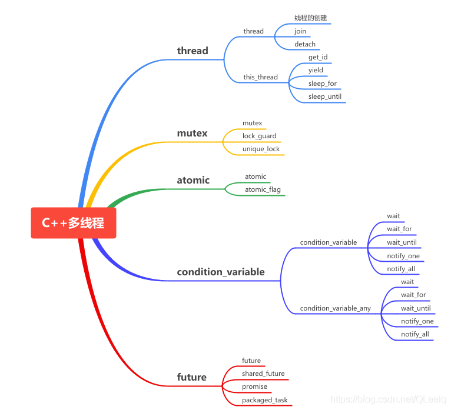
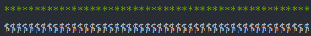

# C++多线程

## 多线程与多进程

c++11之前没有引入线程这个概念，需要借助操作系统提供API来提供，如Linux的<pthread.h>，或Windows下的<windows.h>。

c++11提供了语言层面的多线程，包含着<thread.h>中，解决了跨平台的问题，提供了`管理线程`、`保护共享数据`、`线程间同步操作`、`原子操作`等。C++11新标准引入了5个头文件来支持多线程编程：



**线程是轻量级进程**，一个进程可以执行多个线程。

1. 多进程并发

将一个应用程序划分为多个独立的进程（一个进程只要一个线程），虽然独立进程间可以通信，操作系统提供了大量的保护机制，但存在两个问题：

* 比较复杂、速度较慢
* 多进程开销很大

2. 多线程并发

   一个进程中执行多个线程。

   * 优点：线程不独立拥有资源，同一进程内多个线程共享相同的地址空间，可以访问进程中的大部分数据，==指针和引用可以在线程间进行传递==。
   * 缺点：缺少操作系统保护机制，需要程序员做更多工作。

* 一个进程中每个线程都有自己独立的栈，所有的线程共享一个堆。

## 创建线程

**注意**：只要创建了线程对象（前提是：实例化std::thread对象时传递了"函数名/可调用对象"）,线程就开始执行。所以不应该在创建了线程之后就马上join，这样会马上阻塞**主线程**。应当在晚一点的位置调用join。

* 形式1：

  ```c++
  std::thread myThread(thread_fun);		//函数形式为 void thread_fun()
  myThread.join();
  //同一个函数可以代码复用，创建多个线程
  ```

* 形式2：

  ```c++
  std::thread myThread(thread_fun(100));//函数形式void thread_fun(int x)
  my_thread.join(); 
  ```

* 形式3：

  ```c++
  std::thread myThread(thread_fun,1).detach();
  //直接创建线程，没有名字
  //函数形式 void thread_fun(int x);	
  ```

#### join与detach方式

这是两个线程阻塞方法！二者区别在于是否等待子线程执行结束。

当线程启动后，**一定要在thread销毁前**，确认以何种方式等待线程执行结束：

* detach:启动的线程自主在后台运行，**当前的代码**继续执行下去，不等待新线程结束。

* join:等待启动的线程**完成**，才会继续往下执行。

  可以用`joinable`判断是join还是detach；

  ```c++
  if(myThread.joinable()) foo.join();
  ```

举例：

join方式：join线程后面的代码不会被执行，除非子线程结束。

```c++
#include <iostream>
#include <thread>
using namespace std;
void thread_1(){
	while(1){	
	}
}
void thread_2(int x){
    while(1){  
    }
}
int main(){
    thread myThread1 (thread_1);
    thread myThread2 (thread_2,10);
    myThread1.join();	//pauses until myThread1 finish
    myThread2.join();	//pauses until myThread2 finish
    while(1){
        cout<<"主线程";
    }
    return 0;
}
```

detach方式：主线程不会等待子线程是否执行结束。

```c++
myThread1.detach();
myThread2.detach();
while(1){
	cout<<"主线程";
}
return 0;
```

注意，使用detach，一定要确保线程结束之前可访问数据的有效性，使用指针和引用需要额外谨慎。因为线程创建后就开始执行了，detach()方式，子线程后台运行，而主线程没有被阻塞，当主线程执行完后，或者以引用的方式向子线程传递的有变量，改变量的有效性就不能保证了。

调用join()会清理线程相关的存储部分，这代表了join()只能调用1次，detach()也只能调用一次。

#### this_thread类

包含4个功能函数：

| 函数        | 使用                                                   | 说明                       |
| ----------- | ------------------------------------------------------ | ----------------------- |
| get_id      | std::this_thread::get_id()                             | 获取线程id                 |
| yield       | std::this_thread::yield()                              | 放弃线程执行，回到就绪状态 |
| sheep_for   | std::this_thread::sleep_for(std::chrono::seconds(1))   | 暂停1秒                    |
| sleep_until | std::this_thread::sleep_until(std::chrono::secondes(1)) | 1秒之后执行                |

```c++
using std::chrono::system_clock;
std::time_t tt = system_clock::to_time_t(system_clock::now());
struct std::tm* ptm = std::localtime(&tt);
cout<<"Waiting for the next minute to begin";
++ptm->tm_min;	//加1分钟
ptm->tm_sec = 0;	//秒数设置为0
//暂停执行，等待下一整分执行
this_thread::sleep_until(system_clock::from_time_t(mktime(ptm)));
```

## 线程休眠

### sleep_for()

`std::this_thread::sleep_for();`阻塞线程一段时间，sleep时间从纳秒到小时都可以：

```c++
std::chrono::nanoseconds	//纳秒
std::chrono::microseconds	//微秒
std::chrono::milliseconds	//毫秒
std::chrono::seconds		
std::chrono::minutes
std::chrono::hours
```

```c++
std::this_thread::sleep_for(std::chrono::milliseconds(10));
```

### sleep_until()

`std::this_thread::sleep_until();`休眠到某个时间点

* 休眠到10秒后的时间点

  ```c++
  std::chrono::system_clock::time_point timePoint = std::chrono::system_clock::now() + std::chrono::seconds(10);
  std::this_thread::sleep_until(timePoint);
  ```

* 休眠到2030年11月12日8点30分12秒

  ```c++
  struct std::tm t{};
  t.tm_year = 2030 - 1900;
  t.tm_mon = 11 - 1;
  t.tm_mday = 12;
  t.tm_hour = 8;
  t.tm_min = 30;
  t.tm_sec = 12;
  std::chrono::system_clock systemClock;
  std::this_thread::sleep_until(systemClock.from_time_t(mktime(&t)));
  ```

  

## mutex

mutex头文件主要声明了与互斥量(mutex)相关的类，mutex提供了4种互斥类型：

| 类型                       | 说明            |
| -------------------------- | --------------- |
| std::mutex                 | 最基本的Mutex类 |
| std::recursive_mutex       | 递归Mutex类     |
| std::time_mutex            | 定时Mutex类     |
| std::recursive_timed_mutex | 定时递归Mutex类 |

* std::mutex是c++11最基本的互斥量，不支持递归地对std::mutex对象上锁，而std::recursive_lock可以递归地对互斥量对戏上锁。
* recursive_lock:同一个线程可以多次获取并释放，当获取次数与释放次数匹配时才真正释放。

### lock与unlock

* lock():资源上锁
* unlock()
* trylock():查看是否上锁，有以下3类情况
  * 未上锁，返回false，并锁住
  * 其他线程已上锁，返回true
  * 同一个线程已经对它上锁，将会产生死锁

**同一个mutex变量上锁后，一个时间段内，只允许一个线程访问它**。

```c++
#include <iostream>
#include <thread>
#include <mutex>
//using namespace std;
std::mutex mtx;
void print_block(int n,char c){
    mtx.lock();
    for(int i = 0; i<n; ++i){
        std::cout<<c;
    }
    mtx.unlock();
}
int main(){
    std::thread th1(print_block,50,"*");	//线程1，打印*
    std::thread th2(print_block,50,"$");	//线程2，打印$
    th1.join();
    th2.join();
}
```

输出结果:



如果是不同的互斥量，因为不涉及到统一资源的竞争，因此下列代码可能会出现交替打印情况：

```c++
void print_block_1(int n,char c){
    mtx1.lock();
    for(int i = 0; i<n; ++i){
        std::cout<<c;
    }
    mtx1.unlock();
}
void print_block_2(int n,char c){
    mtx2.lock();
    for(int i = 0; i<n; ++i){
        std::cout<<c;
    }
    mtx2.unlock();
}
……
std::thread th1(print_block_1,10000,"*");
std::thread th2(print_block_2,10000,"$");
th1.join();
th2.join();
```

### lock_guard

创建lock_guard对象时，它将尝试获取提供给它的互斥锁的所有权。当控制流离开lock_guard对象的作用域时，lock_guard析构并释放互斥量。

可替代`lock()`、`unlock()`.

特点如下：

* **创建即加锁**，作用域结束自动析构并解锁，**无需手动解锁**
* **不能中途解锁**，不行等作用域结束
* 不能复制
* **可以通过{}来调整作用域范围**

```c++
int g_i = 0;
std::mutex g_i_mutex;	//实例化对象
void safe_increment(){
    const std::lock_guard<std::mutex> lock(g_i_mutex);	//此语句替代了g_i_mutex.lock(); lock_guard传入一个参数时，该参数为互斥量，此时调用了lock_guard的构造函数，申请锁定g_i_mutex。
    ++g_i;
    std::cout<<std::this_thread::get_id()<<": "<<g_i<<'\n';
    //g_i_mutex自动解锁
    //此时自动调用lock_guard的析构函数，自动解锁
}
void proc_test(){
    {
        lock_guard<std::mutex> lock2(g_i_mutex);
        cout<<"作用域";
    }
    ……
}
int main(){
    std::cout<<"main id"<<std::this_thread::get_id()<<std::endl;
    std::cout<<"main"<<g_i<<"\n";
    std::thread t1(safe_increment);
    std::thread t2(safe_increment);
    t1.join();
    t2.join();
    std::cout<<"main"<<g_i<<'\n';
}
```

说明：

1. 该程序功能是，每经过1个线程，g_i加1；
2. 因为涉及到共用资源g_i，所以需要一个共同的Mutex:g_i_mutex;
3. main线程的id为1，所以下次的线程id依次加1.

### unique_lock

简单的讲，unique_lock是lock_guard的升级加强版，具有lock_guard的所有功能，同时又具有其它很多方法，使用更强灵活方便。

unique_lock特点：

* 创建时可以不锁定(通过指定第2个参数为std::defer_lock),在需要时再锁定
* 可以随时加锁和解锁
* 作用域规则同lock_guard，析构时自动解锁
* 不可复制，可移动
* 条件变量需要该类型的锁作为参数（此时必须使用unique_lock).

**使用锁时，首先考虑lock_guard，因为lock_guard是最简单的锁。**

**不建议直接使用成员函数lock()，因为容易忘记unlock()解锁，建议使用lock_guard或unique_lock,能避免忘记使用unlock的问题。**

案例：[一文详解C++多线程_非晚非晚的博客-CSDN博客](https://blog.csdn.net/QLeelq/article/details/115747717)

### 死锁

死锁就是多个线程争夺共享资源导致每个线程都不能取得自己所需的全部资源，从而导致程序无法向下执行。

产生死锁的四个必要条件：

* 互斥（资源同一时间只能被一个进程使用）
* 请求并保持（进程在请求资源时，不释放自已已经占有的资源）
* 不剥夺（进程已经获得的资源，在进程使用完前，不能强制剥夺）
* 循环等待（进程间形成环状的资源循环等待关系）

### 临界区

速度最快，但只能作用于同一进程下不同线程，不能作用于不同进程；可确保某一代码段同一时刻只能被一个线程执行。

```c++
EnterCriticalSection ();	//进入临界区
LeaveCriticalSection ();	//离开临界区
```

### 信号量

当多个线程同一时刻访问共享资源时，进行线程的计数，确保同时访问资源的线程数目不超过上线，当访问数据超过上限后，不发出信号量。

## condition_variable

注意：condition_variable类搭配mutex使用，该类的作用是用来同步线程的，通过notify_one()或notify_all()通知调用wait()进入阻塞状态的线程。

`condition_variable`的头文件有两个variable类，一个是`condition_variable`,一个是`condition_variable_any`。**`condition_variable`必须结合`unique_lock`使用，**`condition_variable_any`可以使用任何的锁。

std::condition_variable类搭配std::mutex类使用，condition_variable对象(std::condition_variable cond;)的作用不是用来管理互斥量，它的作用是用来同步线程的，相当于编程中的flag标志。

### wait

wait函数需要传入一个`std::mutex`(一般会传入`std::unique_lock`对象),`wait`函数会自动调用`locker.unlock()`释放锁并阻塞当前线程。本线程释放锁使得其它线程得以继续竞争锁。

一旦当前线程获得了`notify`(通常是其它线程调用notify_one/notify_all唤醒了该线程),wait函数会自动调用`locker.lock()`上锁。(意思是锁住临界区)

* `cond.notify_one()`:随机唤醒一个等待的线程
* `cond.notify_all()`:唤醒所有等待的线程

同样，`wait()`也能够同时接收一个`std::unique_lock<mutex>`对象和一个返回为`bool`的表达式或函数，调用后若表达式的值或函数返回值为`false`才会阻塞当前线程。

wait也有wair_for和wait_until两个版本：

* wait_for()

除了条件变量,阻塞时间超过了指定时间后也会自动返回唤醒；

* wait_until()

除了条件变量,过了指定时刻若还被阻塞，就会自动返回唤醒。

这两个函数同样可以传入表达式，可以非常方便的通过函数的返回值区分是否成功被唤醒、还是超时被自动唤醒。当超时自动返回时，即便表达式的值为false也会唤醒，并自动获取mutex。

```c++
//注意，wait的互斥锁对象
mutex m;
condition_variable condConsumer;
//运用
unique_lock<mutex> lockerConsumer(m);
//...
condConsumer.wait(lockerConsumer);
//具备返回值的
condConsumer.wait(lockerConsumer, []{return msg_queue.size() > 0;});//如果队列中元素>0,则结束等待(false才会阻塞当前线程),相当于添加了一个判断条件,等待notify_one或notify_all信号.
```


## 异步线程

需要`<include <future>`。

### async和future

std::async是一个函数模板，用来启动一个异步任务，它返回一个std::future类模板对象，future对象起到了占位的作用。刚实例化的future对象是没有存储值的，但是调用std::future对象的get()成员函数后，主线程会阻塞直到异步线程执行结束，并将返回结果传递给std::future。

比如有一个复杂的计算任务，需要消耗一定的时间，就可以用这个异步线程，创建以后(子线程开始运行)，主线程可以继续执行其它任务，过一段时间，调用get()函数(未完成·阻塞),直到拿到结果(子线程return)，结束阻塞。

```c++
#include <thread>
#include <mutex>
#include <future>
double t1(const double a, const double b) {
    double c = a + b;
    Sleep(3000);	//假设t1是一个复杂的计算函数，需要消耗3s
    return c;
}
int main(){
    double a = 2.3, b = 6.7;
    future<double> fu = async(t1,a,b);	//创建异步线程，并将线程的执行结果用fu占位。
    std::cout<< "正在计算";
    //...其它语句
    std::cout<< fu.get();	//阻塞线程，直到获取到return
    return 0;
}
```

### shared_future

与future一样都是占位，只是std::future的get()成员函数是转移数据所有权，而shared_future()的get()是复制数据。因此，**std::future的get()只能调用一次，无法实现多个线程等待同一个线程；**而std::shared_future的get()可以调用多次，多个线程等待同一个异步线程，每个线程都可以获取异步线程的返回值。

## 原子类型atomic<>

原子操作指"不可分割的操作"，也就是不可能执行一半被打扰，与互斥量类似，不过互斥量加锁一般都是针对一个代码段，而原子操作一般针对一个变量。std::atomic<>是一个模板类。

比如，某一个变量是多个线程都会用到的，每次访问都要上锁以及解锁，比较繁琐；而将改变量实例化(std::atomic<int> I = 0)，就避免了lock与unlock，而且保证线程之间不会冲突。

std::atomic<>对象提供了常见的原子操作，但注意执行的操作是否支持原子性，如果对它进行的运算不支持原子性，也不能实现其原子效果。一般针对++、--、+=、-=、&=、|=、^=是支持的。

```c++
std::atomic<bool> b(true);
b = false;
```


## 线程池

因为程序边运行边创建线程是比较耗时的，因此通过池化思想，在程序开始运行时创建多个线程，这样程序运行时，只需从池里拿来用。

一般线程池会有以下几个部分组成：

* 线程池管理器(ThreadPoolManager):用于创建并管理线程池，也就是线程池的类
* 工作线程(WorkThread):线程池中的线程
* 任务队列task：用于存放没有处理的任务，提供一种缓冲机制
* append：用于添加任务的接口。

```c++
#ifndef _THREADPOOL_H
#define _THREADPOOL_H
#include <vector>
#include <queue>
#include <thread>
#include <iostream>
#include <stdexcept>
#include <condition_variable>
#include <memory>	//unique_ptr
#include <assert.h>

const int MAX_THREADS = 1000;	//线程最大数目
template <typename T>
class ThreadPool
{
public:
    ThreadPool(int number = 1);		//默认开一个线程
    ~ThreadPool();
    std::queue<T *>task_queue;		//任务队列
    bool append(T* request);		//往请求队列<task_queue>中添加任务<T*>
    
private:
    //工作线程需要运行的函数，不断的从任务队列中取出并执行
    static void* worker(void* arg);
    void run();
    
private:
    std::vector<std::thread> work_threads;	//工作线程
    std::mutex queue_mutex;
    std::condition_variable condition;		//必须与unique_lock配合使用
    bool stop
};	//end class

//构造函数，创建线程
template <typename T>
ThreadPool<T>::ThreadPool(int number) : stop(false)
{
    if(number < 0 || number > MAX_THREADS){
        throw std::exception();
    }
    for(int i = 0; i < number; i++){
        std::cout<<"created Thread num is :"<<i <<std::endl;
        work_threads.emplace_back(worker,this);	//添加线程
        //直接在容器尾部创建这个元素，省去了拷贝或移动元素的过程
    }
}
template <typename T>
inline ThreadPool<T>::~ThreadPool()
{
    std::unique_lock<std::mutex> lock(queue_mutex);
    stop = true;
    condition.notify_all();
    for(auto &ww: work_threads){
        ww.join();	//可以在析构函数中join
    }
}

//添加任务
template <typename T>
bool ThreadPool<T>::append(T* request)
{
    //操作工作队列时一定要加锁，因为它被所有线程共享
    queue_mutex.lock();	//同一类的锁
    tasks_queue.push(request);
    queue_mutex.unlock();
    condition.notify_one();		//线程池添加进去了任务，自然要通知等待的线程
    return true;
}

//单个线程
template <typename T>
void *ThreadPool<T>::worker<void *arg)
{
    ThreadPool *pool = (ThreadPool*)arg;
    pool->run();		//线程运行
    return pool;
}
template <typename T>
void ThreadPool<T>::run()
{
    while(!stop){
        std::unique_lock<std::mutex> lk(this->queue_mutex);
        //unique_lock()出作用域会自动解锁
        this->condition.wait(lk,[this]{return !this->tasks_queue.empty();});
        //如果任务为空，则wait，停下来等待唤醒
        //需要有任务，才启动该线程，不然就休眠
        if(this->tasks_queue.empty()){
            assert(0&&"断了");		//实际上不会执行到这一步，因为任务为空，线程就休眠了
            continue;
        }
        else{
            T *request = tasks_queue.front();
            tasks_queue.pop();
            if(request)	//来任务了，开始执行
            	request->process();
        }
    }
}
#endif
```

说明：

* 构造函数创建所需要的线程数
* 一个线程对应一个任务，任务随时可能完成，线程则可能休眠，所以任务用队列queue实现（线程数量有限），线程用采用wait机制。
* 任务在不断的添加，有可能大于线程数，处于队首的任务先执行。
* 只有添加任务(append)后，才开启线程condition.notify_one()。
* wait表示，任务为空时，则线程休眠，等待新任务的加入。
* 添加任务时需要添加锁，因为共享资源。

测试代码：

```c++
#include "mythread.h"
#include <string>
#include <math.h>
using namespaec std;
class Task
{
	public:
	void process(){
		//测试任务数量
		long i = 100000;
		while(i!=0){
			int j = sqrt(i);
			i--;
		}
	}
};
int main(void){
	ThreadPool<Task> pool(6);		//6个线程，vector
	string str;
	while(1){
		Task* tt = new Task();
		pool.append(tt);	//不停的添加任务，任务是队列queue，因为只有固定的线程数
		cout<<"添加的任务数量" << pool.tasks_queue.size()<<endl;
		delete tt;
	}
}
```

## 应用

### 传参

thread的构造参数传递需要注意,根据对象的不同,传参的方式也有区别.

1. 普通函数: 直接传入函数名,参数按顺序传入即可

   ```c++
   void fun(int a, int b){
       printf("%d\n",a+b);
   }
   int main(){
       std::thread myThread(fun, 1,2);	
       myThread.join();
   }
   ```

2. 类成员函数:

   注意:类的成员函数是有真正地址的,利用 `&类名::函数名`可以拿到成员函数的地址.

   * 类外调用

     ```c++
     class Test{
     public:
         void fun(int a, int b);
     }
     int main(){
         Test test;
         std::thread myThread(&Test::fun,&test,a, b);	//实测,有时候直接传入test不会报错,有时候必须&test,以引用方式传入test!!!
         //尽量都使用引用方式传入吧
     }
     ```

   * 类内调用 ==**一定要加this指针**==

     ```c++
     class Test {
     public:
     	void fun(int a, int b);
         void start();
     }
     void Test::start(){
         _thread = std::thread(&Test::fun, this, a, b);	//必须要传入this,否则报错 c2672 "invoke"错误
     }
     ```

     * c2672 "invoke":未找到匹配的重载函数:这个就是thread函数传参错误.
     * 网上有提到其中一个错误是因为函数采用了引用方式,不能直接输入a,需要使用std::ref(a)

3. 类静态成员函数

   类静态成员函数不需要指定类对象.

   ```c++
   class Test{
   public:
   	static void fun(int a, int b);
   }
   int main(){
       std::thread t(&Test::fun,a , b);
   }
   ```

   

### Linux平台 CMake构建

由于标准库的thread调用了pthread,一般报错会有: undefined reference to 'pthread_create'.

在CMakeLists.txt中调用Threads库:

```cmake
find_package(Threads REQUIRED)
target_link_libraries(${PROJECT_NAME} Threads::Threads)
```

